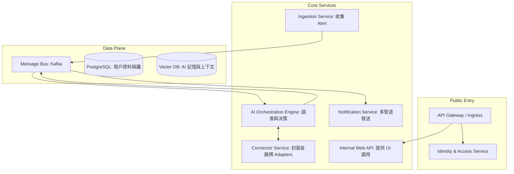

# MDR 技術架構與路徑圖 (Technical Architecture & Roadmap)

本文件詳述了 MDR 系統的技術實作細節，包括服務架構、技術棧以及分階段開發計。

## 1. 系統架構設計 (System Architecture)
採用 **微服務架構** 與 **Provider-Driver 模式** 來處理多租戶與異質產品整合。

### 1.1. 微服務模組

## 2. 技術棧 (Technology Stack)
*   **後端**: Python (AI 調度與 LLM 整合) / Go (高效能資料收集)。
*   **資料緩衝**: Kafka (確保高流量告警時的系統韌性)。
*   **資料庫**: 
    *   PostgreSQL (Schema-per-tenant 隔離)。
    *   Redis (Token 緩存與狀態)。
    *   Pinecone/Milvus (向量化歷史上下文)。
*   **前端**: React + TailwindCSS + React Flow (視覺化調查流程)。

## 3. 開發路線圖 (Development Roadmap)

### **Phase 0: 核心框架與基石 (Week 1-3)**
*   **目標**: 建立底層通訊與租戶管理機制。
*   **任務**:
    - [x] 定義通用 Alert 與 Tool Schema。
    - [ ] 實現 Tenant Manager 與資料庫隔離邏輯。
    - [ ] 建立基礎 Ingestion 管道。

### **Phase 1: 轉接器層 (Adapter Layer) 實作 (Week 4-6)**
*   **目標**: 實現資料標準化與標準工具庫。
*   **重點**: 採用 Provider-Driver 模式，將 Playbooks 視為 "Skills" 以極小化 Token 消耗。

### **Phase 2: AI 調查引擎與 Tool Calling (Week 7-10)**
*   **目標**: 實現 AI 自發調查與決策邏輯。

### **Phase 3 & 4: 視覺化、互動通知與規模化 (Week 11+)**
*   **目標**: 提供 Dashboard、IM 互動式通知 (Line/Telegram) 並擴展 AI Hunting 能力。

## 4. Phase 0 檢核清單 (Definition of Done)
*   [x] 定義完成通用 Alert 與 Tool Schema。
*   [ ] 可以成功建立新租戶，且 DB 自動生成對應 Schema。
*   [ ] 可以發送模擬 Alert，經由 Adapter 轉換後正確進入 Kafka。
*   [ ] AI 核心能透過轉接器 API 呼叫模擬工具 (Mock Tools)。
