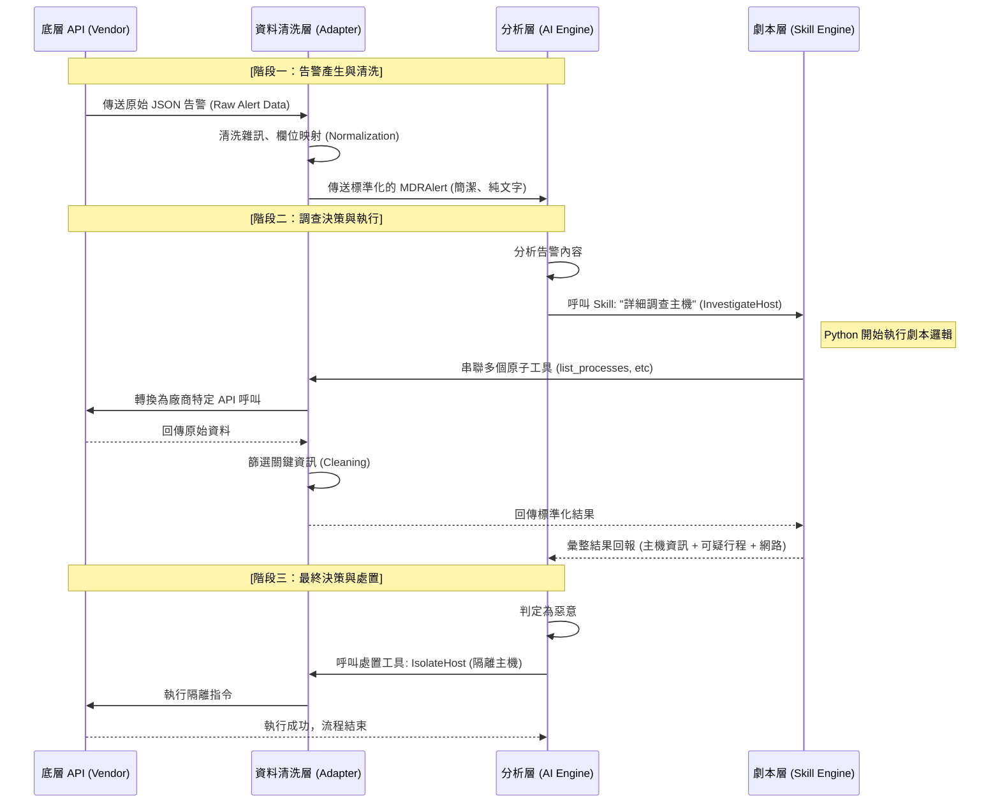

# MDR 核心平台 (Core Platform)

本文件定義了 MDR 系統的核心願景、層級分工以及整體的資料處理流程。

## 1. 專案概述 (Project Overview)
本專案旨在建構一個**支援多租戶 (Multi-Tenant) 的智慧化託管偵測與回應 (MDR) 平台**。
核心目標是將異質資安產品（XSOAR, EDR, Firewall 等）的 API 與邏輯進行抽象化封裝，並引入 **AI 決策引擎** 來自動化執行告警分析、主動威脅獵捕 (Threat Hunting) 及聯防阻擋。

## 2. 系統層級職責 (Layer Responsibilities)
為了確保高可擴展性並降低 AI 運算成本，系統分為以下四層：

1.  **底層 API 層 (Vendor API)**：負責與廠商原始接口（如 Fidelis API）進行通訊，管理認證與網路連線。
2.  **資料清洗與轉接層 (Adapter Layer)**：將原始「髒資料」過濾雜訊，並標轉化為統一的 `MDRAlert` 或 `MDREntity`。
3.  **API 劇本層 (Skill/Playbook Layer)**：將複雜的多步調查動作（如：檢查行程 -> 查網路連線）封裝為單一功能函數。
4.  **分析層 (Analysis Layer / AI Engine)**：大腦，負責基於精簡後的標準化資料進行推理，並決定呼叫哪些工具或發起處置。

## 3. 完整處理流程 (Full Workflow)
當一個告警觸發時，系統的互動邏輯如下：

## 4. 關鍵效益 (Key Benefits)
*   **成本控管**：Adapter 負責把 1MB 的垃圾資料洗成 1KB 的黃金資料，大幅降低 LLM Token 消耗。
*   **解耦設計**：AI 不直接對付髒資料與差異化 API。更換底層產品時，AI 與劇本邏輯無需修改。
*   **維護性**：透過標準化介面，開發者只需為新產品編寫對應的 Adapter 即可上線。
